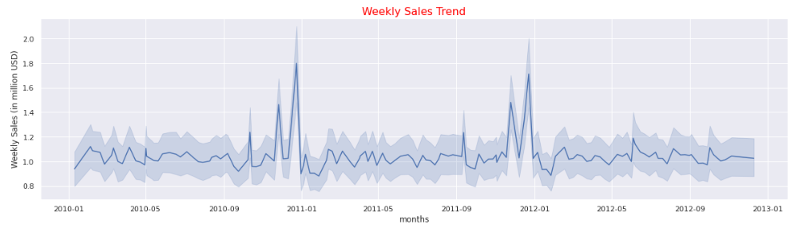

# Walmart Sales Analysis and Prediction 

*Photo by [Walmart](https://cdn.corporate.walmart.com/dims4/WMT/26fb832/2147483647/strip/true/crop/2400x1332+0+134/resize/980x544!/quality/90/?url=https%3A%2F%2Fcdn.corporate.walmart.com%2Fb6%2Fc6%2F5e1cb86e49f6948b3298e76c1123%2Fpress-hero-1.jpg)*

## Introduction
Sales analysis and forecasting are essential tools for businesses to understand and improve their sales performance and make informed decisions about their future sales goals (B2B International, 2018). By analyzing past sales data, businesses can identify trends and patterns that can help them understand what is driving their sales and where they may need to focus their efforts to improve (Small Business Administration, 2021). Forecasting allows businesses to project future sales based on these trends and patterns, helping them to set realistic goals and allocate resources appropriately (Business News Daily, 2021).

The importance of sales analysis and forecasting extends beyond just understanding sales performance. It is also crucial for budgeting and financial planning. By understanding their expected sales, businesses can better plan for expenses and allocate resources to meet their financial goals (Small Business Administration, 2021). Additionally, sales analysis and forecasting can help businesses identify opportunities for growth and new areas for expansion (B2B International, 2018).

In this project, we analyzed Walmart's weekly sales data across 45 different stores to gain insights into their sales performance and identify trends and patterns. We will then use this data to forecast future sales, which can assist Walmart in making informed strategic decisions. This analysis will provide Walmart with valuable information on how to optimize their sales and allocate resources effectively. Additionally, by understanding how sales vary across different stores, Walmart can identify areas for improvement and potential opportunities for growth. Overall, this project will enable Walmart to gain a deeper understanding of their sales performance and make data-driven decisions to drive future success.

### Data Description
The file `Walmart.csv` was obtained from [Kaggle](https://www.kaggle.com/datasets/yasserh/walmart-dataset) website.
### Dependencies
To run this project successfully, one needs to install and import the following dependencies:
- [NumPy](https://numpy.org)
- [Pandas](https://pandas.pydata.org)
- [Scikit-learn](https://scikit-learn.org/stable/)
- [Seaborn](https://seaborn.pydata.org)
- [Matplotlib](https://matplotlib.org)

## Data Wrangling 
During the data wrangling process, thorough checks were conducted on the dataset to identify and address various data quality issues. This included examining the dataset for missing values, duplicate entries, outliers, errors, and inconsistencies. By performing these meticulous checks, we aimed to enhance the reliability and integrity of the dataset, ensuring its suitability for accurate and insightful analysis.

## Exploratory Data Analysis
The dataset underwent a comprehensive analysis, focusing on key metrics such as average weekly sales, sales trends, and revenue generation. The goal was to extract valuable insights that can be translated into actionable strategies. By examining these aspects of the dataset, we aimed to uncover meaningful patterns, identify areas of opportunity, and make informed decisions to drive business growth and optimize revenue generation. The figure below shows the variations of weekly sales over time in the dataset.

*Weekly Sales Trend*

## Model Selection and Evalaution
In this project, various regressors were used to model the dataset. The Random Forest regressor model had the lowest root mean square error of 1.17e+05 and was the best model for the data.

## Conclusions 
The analysis shows that sales during holiday weeks are significantly higher than during non-holiday weeks, with sales doubling on average. Additionally, there is a strong seasonal component to the sales data. The average sales of the top performing stores are up to 500% higher than the lowest performing stores. 

The best model for predicting future sales is the Random Forest Regressor model,which achieved an RMSE of 1.17e+05. This is a good estimate as it is 88% close to the median sale of the data.

These findings have important implications for **Walmart** as they can inform decisions about inventory, staffing, and marketing efforts. By understanding the factors that drive sales and using a reliable model to forecast future sales, **Walmart** can better plan for the future and optimize their resources. 

## License 
The project is licensed under the MIT License.
